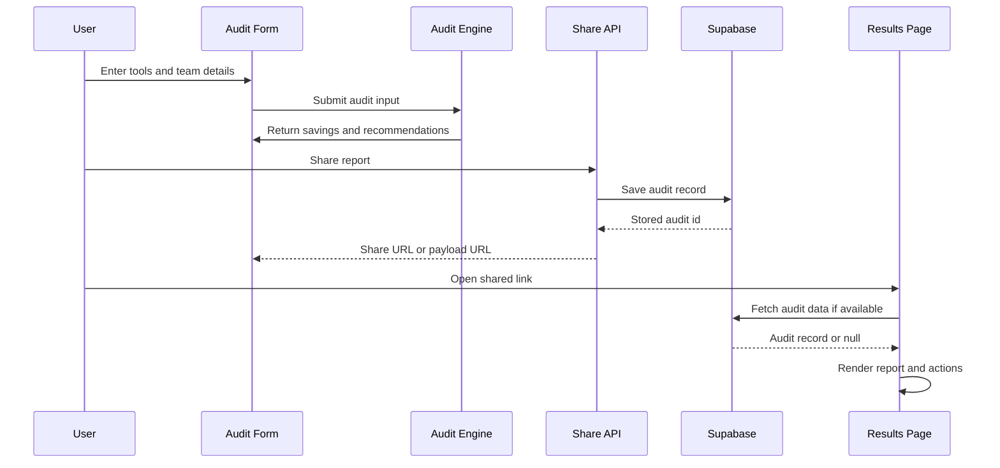

# Architecture

StackAudit is built as a small full-stack Next.js app with a deliberately simple flow: collect the inputs, calculate the savings, store the shareable audit, and render the report page.

## System Diagram

```mermaid
flowchart TD
	A[User opens /audit] --> B[MultiToolForm]
	B --> C[runAudit in src/lib/audit-engine.ts]
	C --> D[Per-tool audits + totals]
	D --> E[AI summary generation]
	D --> F[POST /api/share]
	F --> G[Supabase audits table]
	F --> H[Share URL or payload URL]
	H --> I[/results/[id]]
	G --> I
	I --> J[AuditResults UI]
	J --> K[Copy link / email capture / CTA]
```

## Data Flow

1. A user enters their AI tools, team size, and use case on `/audit`.
2. The form sends that data into the audit engine.
3. The audit engine calculates current spend, optimized spend, monthly savings, annual savings, and a savings percentage.
4. The result is summarized for the UI and sent to the share endpoint when the user shares the report.
5. The share endpoint tries to save the audit in Supabase and returns a link for the shared report.
6. If the database lookup is unavailable, the app can still recover from the encoded payload URL.
7. The shared results route renders the report and lets the user copy the link, email the report, or continue to the audit flow.

## Why This Stack

- Next.js App Router gives one codebase for the marketing site, audit form, API routes, and shareable results pages.
- TypeScript keeps the audit result shape consistent across the form, API, and report views.
- Supabase is a practical fit for storing public audits and lead captures without adding a separate backend service.
- Vitest is enough for the audit engine because the important logic is deterministic math, not heavy browser behavior.
- Tailwind plus a few targeted CSS files let the marketing pages feel custom without turning the app into a maintenance burden.

## What I Would Change for 10k Audits/Day

If this had to handle 10k audits per day, I would split the work more aggressively:

- Move audit generation into a queue so the request path stays fast.
- Cache repeat audits and shared result pages at the edge.
- Add stricter database indexing and a retention policy for old shared results.
- Separate the public report renderer from the write path so sharing does not block on persistence.
- Add rate limiting and abuse protection on the audit and share endpoints.
- Track job status so large audits can return immediately and finish asynchronously.

## Practical Trade-offs

- I kept the audit math deterministic instead of making it fully AI-generated, because predictable numbers are easier to trust.
- I used a payload fallback for shared links, because a result page should still open even when a database lookup fails.
- I kept the product in one Next.js app, because splitting early into multiple services would add more complexity than value.
- I relied on Supabase for persistence, because it is lighter than managing a custom backend and database stack.
- I used a custom landing page and branded assets, because the project needed to look like a real product rather than a starter template.

## Request Lifecycle



