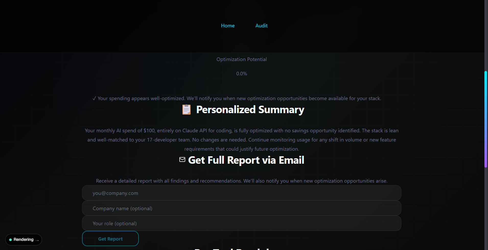

# StackAudit

StackAudit is a simple but opinionated AI spend auditor for teams that are paying for too many overlapping tools. It helps people turn a messy stack of Cursor, Claude, Copilot, ChatGPT, Gemini, and Windsurf subscriptions into a clear savings report they can actually act on.

URL- 

